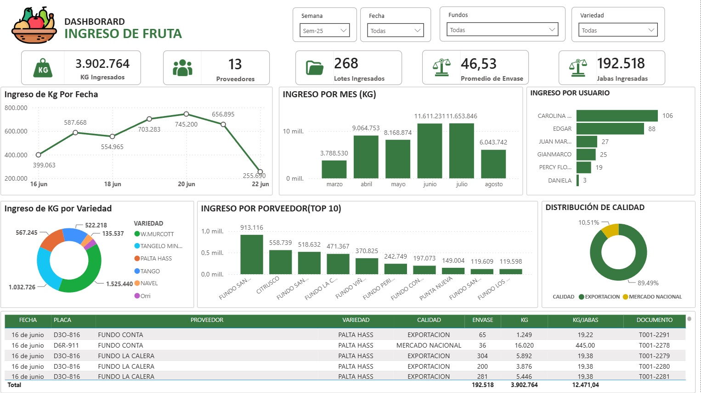
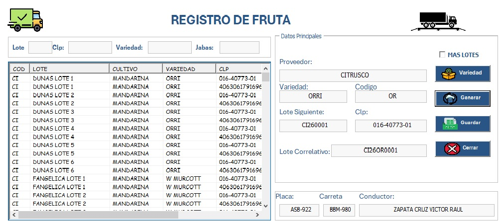
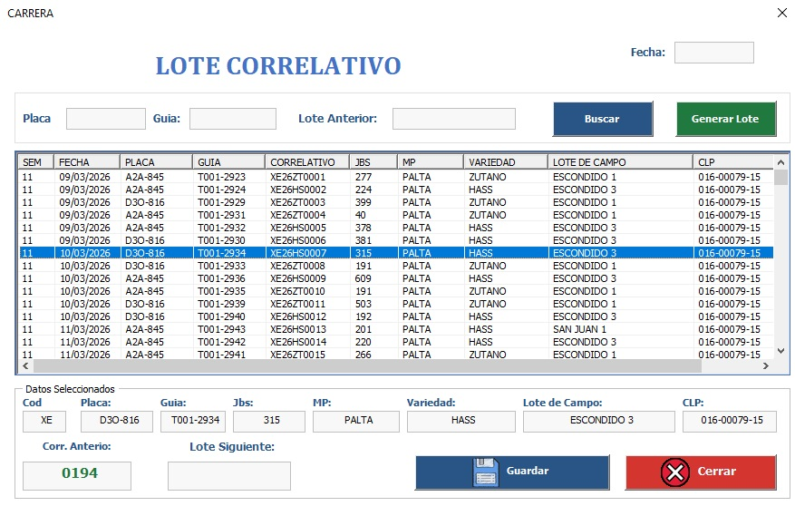
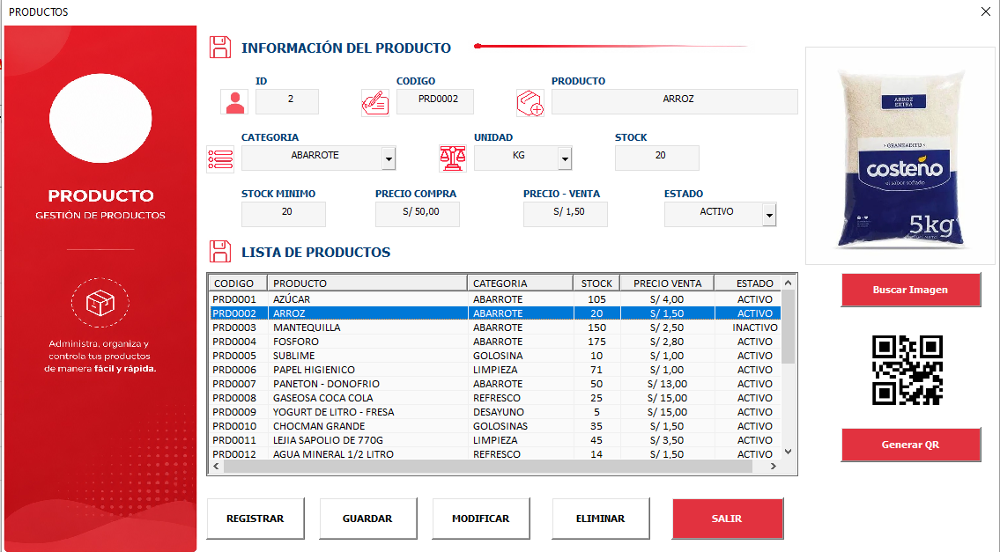
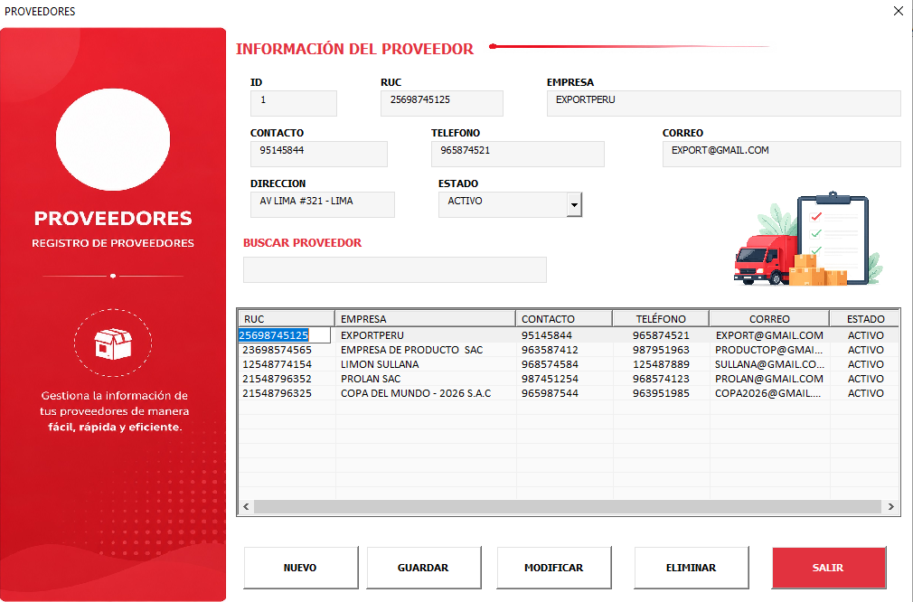
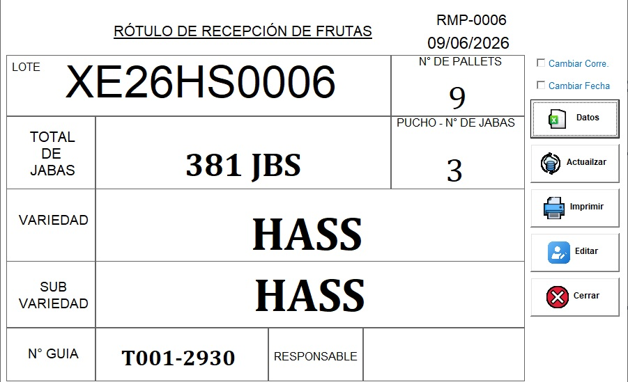
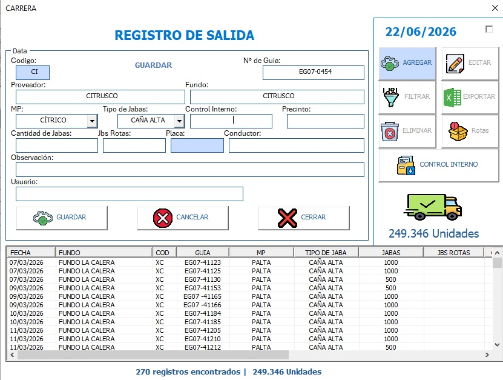
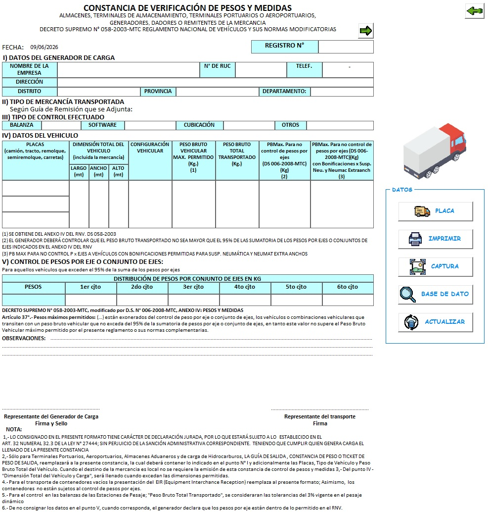

# 👋 Jesús Castilla Carrera

### Técnico en Computación e Informática

📊 Power BI • 📈 Excel VBA • 🗄️ SQL Server • 🏭 SAP S/4HANA

---

# 🚀 Sobre mí

Soy Técnico en Computación e Informática con experiencia en desarrollo de sistemas, análisis de datos y gestión de almacenes.

### Experiencia

✅ Excel Avanzado

✅ VBA

✅ Power BI

✅ SQL Server

✅ SAP S/4HANA

✅ Gestión de Inventarios

✅ Control de Almacén

✅ Recepción de Materia Prima

✅ Guías de Remisión Electrónicas SUNAT

✅ Indicadores de Gestión

✅ Automatización de Procesos

---

# 💼 Experiencia Laboral

### Asistente de Almacén

* Control de ingresos y salidas.
* Gestión de stock.
* Recepción de materia prima.
* Emisión de guías de remisión.
* Control documentario.

### SAP S/4HANA

* Registro y consulta de operaciones.
* Gestión de inventario.
* Seguimiento de movimientos de almacén.

### SUNAT

* Emisión de Guías de Remisión Electrónicas.
* Validación de información tributaria.

---

# 📊 Dashboard Power BI - Ingreso de Fruta

---

# 📊 Dashboard Power BI - Ventas e Inventario

---

# 🍊 Sistema de Recepción de Materia Prima

---

# 🏷️ Generador de Lotes Correlativos

---

# 📦 Gestión de Productos

---

# 🚚 Gestión de Proveedores

---

# 📋 Rótulos de Recepción

---

# 📤 Registro de Salidas

---

# ⚖️ Sistema de Pesos y Medidas

---

# 🛠 Tecnologías

* Excel VBA
* Power BI
* SQL Server
* SAP S/4HANA
* Android Studio
* GitHub

---

# 📈 Estadísticas GitHub

---

# 📫 Contacto

💼 Técnico en Computación e Informática

📍 Chincha - Perú

📧 Email: <a href="mailto:tucorreo@gmail.com">carrera1995.22@gmail.com</a>

🚀 Siempre aprendiendo y desarrollando nuevas soluciones.

⭐ Gracias por visitar mi perfil.

